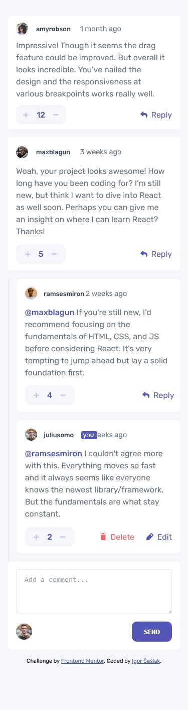
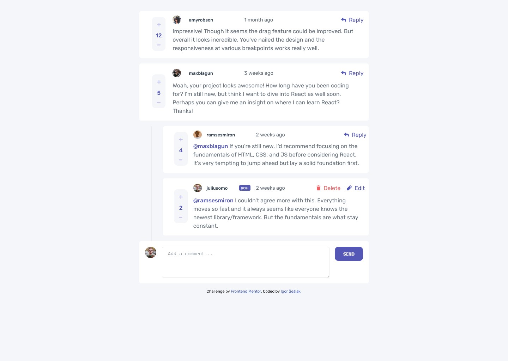

# Frontend Mentor - Interactive comments section solution

This is a solution to the [Interactive comments section challenge on Frontend Mentor](https://www.frontendmentor.io/challenges/interactive-comments-section-iG1RugEG9). Frontend Mentor challenges help you improve your coding skills by building realistic projects.

## Table of contents

- [Overview](#overview)
  - [The challenge](#the-challenge)
  - [Screenshot](#screenshot)
  - [Links](#links)
- [My process](#my-process)
  - [Built with](#built-with)
  - [What I learned](#what-i-learned)
  - [Continued development](#continued-development)
  - [Useful resources](#useful-resources)
- [Author](#author)

## Overview

### The challenge

Users should be able to:

- View the optimal layout for the app depending on their device's screen size
- See hover states for all interactive elements on the page
- Create, Read, Update, and Delete comments and replies
- Upvote and downvote comments
- **Bonus**: If you're building a purely front-end project, use `localStorage` to save the current state in the browser that persists when the browser is refreshed.
- **Bonus**: Instead of using the `createdAt` strings from the `data.json` file, try using timestamps and dynamically track the time since the comment or reply was posted.

### Screenshot

### Links

- Solution URL: [GitHub](https://github.com/himym413/Interactive-Comments-Section)
- Live Site URL: [Vercel](https://interactive-comments-section-ecru.vercel.app/)

## My process

### Built with

- Semantic HTML5 markup
- CSS custom properties
- CSS Grid
- Mobile-first workflow
- Vanilla JS

### What I learned

I learned that you shouldn't start any project without planning and writing diagram. It definitely helps a lot, in a sense that I always know what to do next, and it keeps my mind from trying to do multiple tasks at once.

### Continued development

Definitely want to keep writing diagrams and planning my projects. Hope to get better at it soon, and start writing more detailed diagrams.

### Useful resources

- [Animate.css](https://animate.style/) - This helped me animate my pop-up modal. Really easy to use.

## Author

- Frontend Mentor - [@himym413](https://www.frontendmentor.io/profile/himym413)
